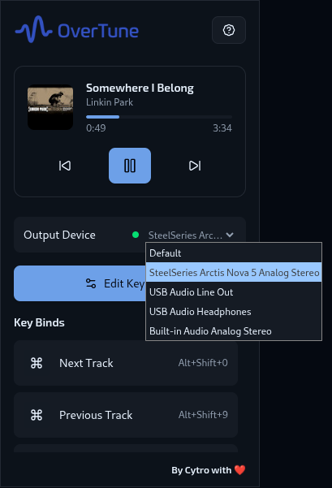

# Over Tune

Over Tune is a Chrome extension that allows you to fully customize your YouTube Music experience.
Whether you want quicker controls, personalized shortcuts, or flexible device routing, Over Tune helps you stay in tune with your music.

## Features

- 🎶 **Now Playing Widget** - Always know what’s playing at a glance.
- ⌨️ **Customizable Shortcuts** - Set your own shortcuts for play, pause, skip, volume, and more.
- 🔊 **Custom Output Device** - Choose and switch your playback device directly from the extension.
- ⚡ **Customizable Actions** (Coming Soon) - Bind actions like opening lyrics, liking a track, or shuffling to keys or buttons.

## Screenshots

## Installation

1. Download the latest `release.zip` from the [Releases page](https://github.com/kyng-cytro/over-tune/releases).
2. Extract the `.zip` file.
3. Open Chrome and go to `chrome://extensions/`.
4. Enable **Developer mode** (toggle in the top-right).
5. Click **Load unpacked** and select the extracted folder.
6. Over Tune should now appear in your extensions bar!

## Help & Usage

Need help getting started?
Check out the [Over Tune Guide](./Guide.md) for setup tips, shortcut customization, audio device switching, and FAQs.

## Contributing

Contributions are welcome!

1. Fork this repository
2. Create a feature branch (`git checkout -b feature/my-feature`)
3. Commit your changes (`git commit -m "Add new feature"`)
4. Push to the branch (`git push origin feature/my-feature`)
5. Open a Pull Request

Please open an issue first if you’d like to discuss a major change.

---
